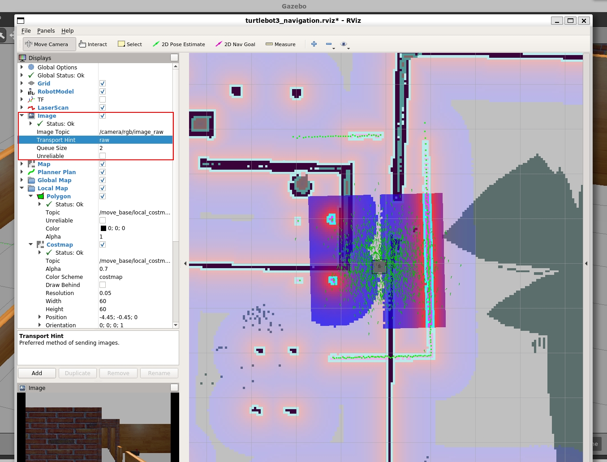

# 智能机器人课程设计

## 实验运行环境

- Ubuntu 18.04
- ROS Melodic Morenia

## 代码结构

代码主要存在两个包里面

- 1.```myrobot_description```包中保存着仿真的机器人模型

- 2.```myrobot```包中包含了世界模型，打开地图的launch文件以及导航代码和人脸识别代码

除此之外，还包含了三个模拟路人的模型，需要自行将文件夹放置在用户目录下并修改.world文件中与Person相关的代码

## 配置环境

- 本实验基于```turtlebot3```实验包完成的，因此需要先自行安装```turtlebot3```相关实验包，turtlebot3安装和使用教程可以在网上找到，这里提供一个安装教程网址：[Turtlebot3入门教程](https://zhuanlan.zhihu.com/p/475365929)

- 本实验代码还参考了Turtlebot迎宾机器人的设计思路，地址为：<https://www.guyuehome.com/35605>,参考的项目代码位置在[https://github.com/SEUZTh/welRbot/tree/smach_state](https://github.com/SEUZTh/welRbot/tree/smach_state)

- 将```myrobot```和```myrobot_description```实验包放入```catkin_ws```编辑环境中并使用```catkin_make```编译:

    ```bash
    cp -r myrobot* ~/catkin_ws
    cd catkin_ws
    catkin_make
    ```

- 配置模型，启动gazebo，加载```Person```文件夹中的.dae文件，具体步骤参考<https://www.bilibili.com/video/BV1rT4y1P7HN/>，加载好之后还需要修改.world中与Person相关的路径

- 将建图结果放置在用户目录下

    ```bash
    cp map.* ~/
    ```

## 测试

- 启动模型

    ```bash
    export TURTLEBOT3_MODEL=waffle 
    roslaunch myrobot myrobot_house.launch
    ```

- 新开一个终端，使用rviz打开所建的图

    ```bash
    export TURTLEBOT3_MODEL=waffle     
    roslaunch turtlebot3_navigation turtlebot3_navigation.launch map_file:=$HOME/map.yaml     
    ```

- 在```rviz```界面中打开```/camera/rgb/image_raw```，如下图



**不打开的话会导致话题```/camera/rgb/image_raw```堵塞，导致不能够保存图片。**

- 初始化小车位姿

    ```bash
    rosrun myrobot initial_pose.py
    ```

- 开始导航并进行人脸检测

    ```bash
    rosrun myrobot navigation.py
    ```
